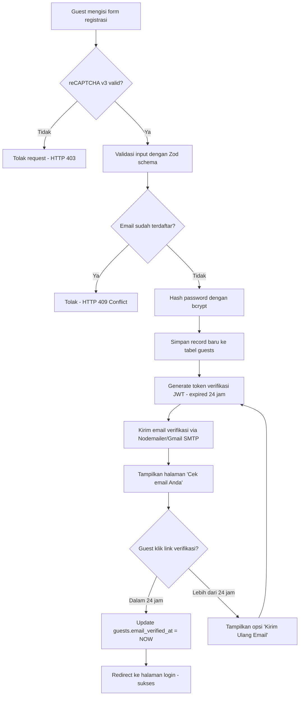
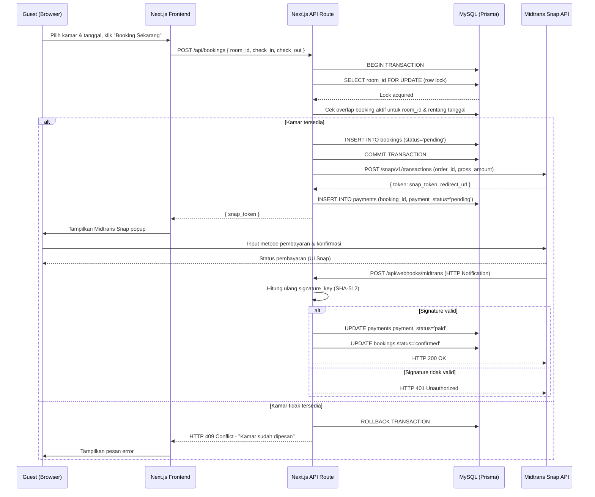
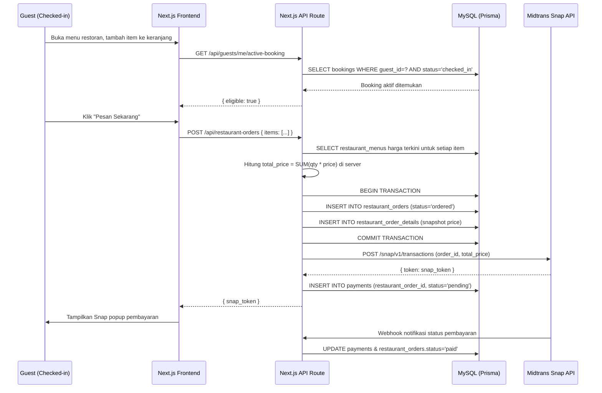
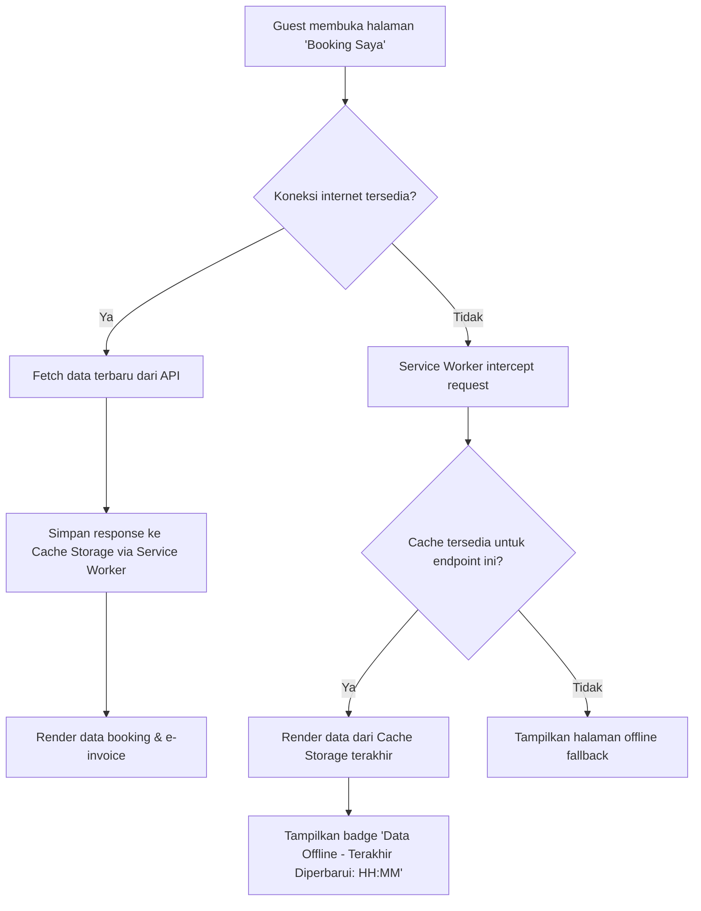

# Product Requirements Document (PRD)
## Sistem Informasi Hotel Online — "drgHotel"

| Atribut | Detail |
|---|---|
| **Versi Dokumen** | 1.0 |
| **Tanggal** | 19 Juni 2026 |
| **Status** | Draft for Review |
| **Tech Stack** | Next.js 14 (Fullstack, App Router) + TypeScript + Tailwind CSS |
| **Database** | MySQL 8 + Prisma ORM |
| **Payment Gateway** | Midtrans Snap (Sandbox) |
| **Email Service** | Nodemailer + Gmail SMTP |
| **PWA** | next-pwa (Service Worker + Cache Strategy) |
| **Sumber PDM** | `drgHotel` — 8 tabel (payments, restaurant_orders, restaurant_order_details, restaurant_menus, guests, bookings, rooms, room_types, users) |

---

## 1. Executive Summary

### 1.1 Problem Statement

Manajemen hotel skala kecil hingga menengah di Indonesia umumnya masih mengandalkan proses manual atau semi-manual (buku tamu, spreadsheet, WhatsApp) untuk dua proses bisnis krusial: **reservasi kamar** dan **pemesanan makanan/restoran in-house**. Pendekatan ini menimbulkan tiga masalah nyata yang dapat diidentifikasi langsung dari struktur data yang ada:

1. **Risiko Double Booking** — Tanpa sistem terpusat yang melakukan validasi status kamar secara atomik, dua tamu dapat dialokasikan ke kamar yang sama pada tanggal yang tumpang tindih, karena status pada tabel `rooms` (`available`, `occupied`, `maintenance`) tidak diperbarui secara real-time dan transaksional.
2. **Rekonsiliasi Pembayaran Manual** — Tabel `payments` memiliki relasi opsional ke `booking_id` **atau** `restaurant_order_id`, yang berarti satu sistem pembayaran harus menangani dua jenis transaksi (sewa kamar dan pesanan restoran) tanpa standar verifikasi otomatis. Tanpa integrasi payment gateway dengan webhook, status `pending`/`paid`/`failed` rawan tidak sinkron dengan kondisi riil pembayaran.
3. **Tidak Ada Visibilitas Operasional Real-Time untuk Manajemen** — Pemilik/manajer hotel (top-level management) tidak memiliki dashboard agregat yang menggabungkan okupansi kamar (`bookings` + `rooms`), pendapatan restoran (`restaurant_orders` + `restaurant_order_details`), dan rekonsiliasi kas (`payments`) dalam satu tampilan, sehingga pengambilan keputusan (misalnya menaikkan harga `room_types` saat peak season) menjadi reaktif, bukan data-driven.

### 1.2 Proposed Solution

**drgHotel** adalah sistem informasi hotel berbasis web *fullstack* yang dibangun di atas **Next.js 14 (App Router)** dengan **TypeScript** sebagai bahasa utama di sisi frontend maupun backend (API Routes/Route Handlers), serta **Tailwind CSS** untuk styling antarmuka. Backend menggunakan **Prisma ORM** di atas **MySQL** sebagai single source of truth yang merepresentasikan 8 entitas pada PDM yang dilampirkan.

Sistem ini menyatukan tiga modul inti dalam satu aplikasi:

- **Modul Reservasi Kamar** — guest dapat mencari ketersediaan `room_types`, melakukan booking ke `rooms` spesifik, dan melakukan check-in/check-out yang divalidasi terhadap status kamar secara transaksional (menggunakan Prisma `$transaction` untuk mencegah race condition).
- **Modul Restoran In-House** — guest yang sedang menginap (terverifikasi melalui `bookings` aktif) dapat memesan dari `restaurant_menus`, yang tercatat sebagai `restaurant_orders` dengan rincian `restaurant_order_details` per item.
- **Modul Pembayaran Terpadu** — seluruh transaksi (booking maupun restaurant order) diproses melalui **Midtrans Snap (Sandbox)**, dengan status pembayaran disinkronkan otomatis melalui **webhook** (HTTP Notification), bukan polling manual.

Keamanan login menggunakan **Google reCAPTCHA v3** dan **email verification** (token-based, dikirim via Nodemailer/Gmail SMTP) sebelum akun guest aktif. Aplikasi mendukung mode **PWA (Progressive Web App)** menggunakan `next-pwa`, sehingga tamu tetap dapat melihat riwayat booking dan e-ticket/invoice terakhir yang telah di-cache meski sedang offline (misalnya saat sinyal lemah di lobi hotel).

Desain UI mengusung tema **"Elegant Heritage"** — palet hijau tua & krem dengan tipografi serif premium untuk judul dan sans-serif bersih untuk isi, menghindari kesan template generik yang umum dijumpai pada aplikasi booking pasaran.

### 1.3 Success Criteria (KPIs)

| # | KPI | Target Terukur | Cara Pengukuran |
|---|---|---|---|
| 1 | **Response Time API** | Rata-rata response time endpoint pencarian kamar (`GET /api/rooms/search`) **< 300ms** (p95) pada beban 50 concurrent request | Load testing (k6/Artillery) di staging |
| 2 | **Zero Double Booking** | **0% kasus double booking** pada rentang tanggal yang sama untuk `room_id` yang sama, diverifikasi melalui constraint unik + transaction lock | Query audit: `COUNT(overlapping bookings per room_id) = 0` setelah 1.000 transaksi simulasi |
| 3 | **Validitas Webhook Pembayaran** | **100% notifikasi Midtrans webhook terverifikasi** signature key (SHA-512) sebelum status `payments.payment_status` diubah | Log audit: jumlah update status payment yang lolos validasi signature / total request webhook = 100% |
| 4 | **Keberhasilan Verifikasi Email** | **≥ 95% email verifikasi terkirim dalam < 10 detik** setelah registrasi, dengan token kedaluwarsa otomatis dalam 24 jam | Monitoring log Nodemailer + tabel `guests.email_verified_at` |
| 5 | **Ketersediaan Mode Offline (PWA)** | **100% halaman "Booking Saya" dapat diakses tanpa koneksi internet** (cached data terakhir), divalidasi via Lighthouse PWA Audit Score **≥ 90** | Lighthouse CI report pada setiap deployment |

---

## 2. User Experience & Functionality

### 2.1 User Personas

Berdasarkan struktur data, sistem mengenali dua kelompok entitas pengguna yang disimpan di tabel berbeda — `users` (internal staff/manajemen) dan `guests` (pengguna eksternal/tamu) — dengan role internal dibedakan melalui kolom logis `role` pada implementasi (ditambahkan sebagai enum pada tabel `users` saat development, karena PDM asli belum mengekspos kolom ini secara eksplisit, namun wajib ada untuk RBAC).

| Persona | Sumber Tabel | Deskripsi | Tujuan Utama |
|---|---|---|---|
| **Guest (Tamu)** | `guests` | Pengguna publik yang mendaftar mandiri, memverifikasi email, dan melakukan booking kamar serta pemesanan restoran. Memiliki data sensitif (`identity_number`, `phone`, `photo_url`) untuk keperluan check-in. | Memesan kamar, memesan makanan saat menginap, melihat riwayat & status pembayaran, melihat e-ticket secara offline. |
| **Admin / Front Office Staff** | `users` (role: `staff`) | Staf operasional yang menangani check-in/check-out manual, validasi identitas tamu, serta mengelola status kamar (`maintenance`, dsb). | Mengelola `bookings`, mengubah `rooms.status`, memproses `restaurant_orders` yang masuk dari dapur/kasir. |
| **Top-Level Management (Manajer/Owner)** | `users` (role: `admin`/`manager`) | Pemilik atau manajer hotel yang membutuhkan visibilitas penuh atas okupansi, pendapatan, dan tren operasional untuk pengambilan keputusan strategis. | Memantau dashboard analitik (revenue, occupancy rate, top-selling menu), mengelola master data `room_types` dan `restaurant_menus`, mengekspor laporan detail. |

> **Catatan Teknis:** Kolom `role` akan ditambahkan secara eksplisit pada model `User` di Prisma schema sebagai `enum Role { STAFF ADMIN }`, karena PDM asli hanya menampilkan kolom autentikasi standar (`name`, `email`, `password`, `remember_token`) tanpa differensiasi peran. Penambahan ini wajib agar RBAC (Role-Based Access Control) dapat diimplementasikan pada middleware Next.js.

### 2.2 Tabel Reverse Engineering PDM

| Tabel PDM | Kunci Data Terkait | Fitur Hasil Reverse Engineering | Penerapan Pada Role |
|---|---|---|---|
| `guests` | `email_verified_at`, `password`, `identity_number`, `photo_url` | Registrasi mandiri dengan verifikasi email wajib; upload foto KTP/Passport saat profil dilengkapi; login dengan reCAPTCHA. | Guest |
| `users` | `email_verified_at`, `remember_token` | Login internal staff/manajer dengan opsi "Remember Me"; akses dashboard berbeda berdasarkan role. | Admin, Top-Level Management |
| `room_types` | `price`, `name`, `description` | Katalog tipe kamar (mis. Deluxe, Suite) dengan harga dasar per malam yang dapat diubah manajer; ditampilkan di halaman pencarian publik. | Guest (lihat & pilih), Manajemen (CRUD) |
| `rooms` | `room_type_id`, `status` (`available`/`occupied`/`maintenance`), `room_number` | Manajemen inventori kamar fisik; validasi ketersediaan real-time saat proses booking; staff dapat menandai kamar `maintenance`. | Admin, Manajemen |
| `bookings` | `guest_id`, `room_id`, `check_in`, `check_out`, `status` (`pending`→`confirmed`→`checked_in`→`checked_out`/`cancelled`) | Mesin reservasi dengan state machine status booking; validasi tanggal overlap untuk mencegah double booking; trigger pembuatan record `payments`. | Guest (buat & lihat booking), Admin (proses check-in/out), Manajemen (laporan okupansi) |
| `payments` | `booking_id` *(nullable)*, `restaurant_order_id` *(nullable)*, `payment_method`, `payment_status` | Satu modul pembayaran terpadu untuk dua jenis transaksi sekaligus; integrasi Midtrans Snap; webhook handler untuk update status otomatis; constraint memastikan salah satu FK terisi (XOR). | Guest (membayar), Admin (verifikasi manual jika perlu), Manajemen (rekonsiliasi kas) |
| `restaurant_menus` | `price`, `foto_url`, `description` | Katalog menu restoran in-house dengan gambar; manajer dapat menambah/menghapus menu dan mengubah harga. | Guest (lihat & order), Manajemen (CRUD menu) |
| `restaurant_orders` | `guest_id`, `total_price`, `status` (`ordered`/`paid`) | Header pemesanan restoran, hanya bisa dibuat oleh guest dengan booking **aktif** (validasi `status = checked_in`); kalkulasi `total_price` otomatis dari detail. | Guest (order makanan), Admin/Kasir (proses pesanan) |
| `restaurant_order_details` | `restaurant_order_id`, `restaurant_menu_id`, `quantity`, `price` | Snapshot harga per item saat order dibuat (price-locking agar perubahan harga menu di masa depan tidak mengubah riwayat transaksi lama). | Guest (rincian struk), Manajemen (analitik menu terlaris) |

### 2.3 User Stories & Acceptance Criteria

#### Epic A — Autentikasi & Keamanan

**US-A1**
> Sebagai **Guest baru**, saya ingin mendaftar menggunakan email dan password, sehingga saya dapat mengakses fitur booking.

**Acceptance Criteria:**
- AC1: Form registrasi memvalidasi reCAPTCHA v3 (score ≥ 0.5) sebelum submit diteruskan ke server; jika gagal, request ditolak dengan HTTP 403.
- AC2: Password di-hash menggunakan **bcrypt** (cost factor ≥ 10) sebelum disimpan ke kolom `guests.password`; password mentah tidak pernah di-log.
- AC3: Setelah registrasi sukses, sistem mengirim email berisi link verifikasi (token JWT signed, expired 24 jam) via Nodemailer; `guests.email_verified_at` tetap `NULL` hingga link diklik.
- AC4: Guest dengan `email_verified_at = NULL` tidak dapat melakukan booking (request `POST /api/bookings` mengembalikan HTTP 403 dengan pesan "Email belum terverifikasi").

**US-A2**
> Sebagai **Admin/Manajer**, saya ingin login dengan kredensial terenkripsi, sehingga akses ke data internal tetap aman.

**Acceptance Criteria:**
- AC1: Endpoint login internal terpisah dari login guest (`/api/auth/staff/login`), menggunakan tabel `users`.
- AC2: Session dikelola menggunakan JWT (httpOnly, secure cookie) dengan refresh token yang direpresentasikan oleh kolom `remember_token`.
- AC3: Middleware Next.js memverifikasi role (`STAFF`/`ADMIN`) sebelum mengizinkan akses ke route `/dashboard/*`; role tidak sesuai → redirect ke halaman 403.

#### Epic B — Reservasi Kamar

**US-B1**
> Sebagai **Guest**, saya ingin mencari kamar berdasarkan tanggal check-in/check-out, sehingga saya hanya melihat kamar yang benar-benar tersedia.

**Acceptance Criteria:**
- AC1: Query pencarian melakukan JOIN antara `room_types` dan `rooms`, lalu mengeksklusi `room_id` yang memiliki `bookings` aktif (`status IN ('confirmed','checked_in')`) dengan rentang tanggal overlap (`check_in < input.check_out AND check_out > input.check_in`).
- AC2: Kamar dengan `rooms.status = 'maintenance'` tidak pernah ditampilkan terlepas dari ketersediaan tanggal.
- AC3: Response time endpoint ini di bawah 300ms (p95) sesuai KPI #1.

**US-B2**
> Sebagai **Guest**, saya ingin melakukan booking kamar dan membayar melalui Midtrans, sehingga reservasi saya terkonfirmasi tanpa risiko double booking.

**Acceptance Criteria:**
- AC1: Proses booking dibungkus dalam **Prisma `$transaction`**: insert ke `bookings` dengan `status = 'pending'` dan **row lock** (`SELECT ... FOR UPDATE` via raw query) pada `room_id` terkait untuk rentang tanggal yang diminta, mencegah race condition saat dua request bersamaan menargetkan kamar yang sama.
- AC2: Setelah `bookings` berhasil dibuat, sistem memanggil Midtrans Snap API untuk membuat transaksi dan mengembalikan `snap_token` ke frontend.
- AC3: Record `payments` dibuat dengan `booking_id` terisi, `restaurant_order_id = NULL`, `payment_status = 'pending'`.
- AC4: Status `bookings.status` berubah menjadi `confirmed` **hanya** setelah webhook Midtrans mengonfirmasi `transaction_status = settlement/capture` DAN signature key webhook tervalidasi (lihat US-D1).
- AC5: Jika pembayaran gagal/expired, `bookings.status` diubah menjadi `cancelled` dan `rooms.status` dikembalikan ke `available` (jika sempat diubah).

**US-B3**
> Sebagai **Admin**, saya ingin memproses check-in tamu, sehingga status kamar dan booking konsisten.

**Acceptance Criteria:**
- AC1: Check-in hanya dapat dilakukan jika `bookings.status = 'confirmed'` dan tanggal hari ini ≥ `check_in`.
- AC2: Saat check-in diproses, `bookings.status → 'checked_in'` dan `rooms.status → 'occupied'` diperbarui dalam satu transaksi atomik.
- AC3: Setelah check-in, guest terkait mendapat akses untuk memesan restoran (lihat Epic C).

#### Epic C — Restoran In-House

**US-C1**
> Sebagai **Guest yang sedang menginap**, saya ingin memesan menu restoran dari kamar saya, sehingga saya tidak perlu turun ke resepsionis.

**Acceptance Criteria:**
- AC1: Endpoint `POST /api/restaurant-orders` memvalidasi bahwa guest memiliki minimal satu `bookings` dengan `status = 'checked_in'`; jika tidak, request ditolak HTTP 403.
- AC2: Setiap item pada `restaurant_order_details` menyimpan **snapshot harga** (`price`) dari `restaurant_menus.price` pada saat order dibuat — bukan referensi langsung — agar perubahan harga menu di kemudian hari tidak mengubah riwayat transaksi.
- AC3: `restaurant_orders.total_price` dihitung otomatis di backend sebagai `SUM(quantity * price)` dari seluruh detail, divalidasi ulang di server (tidak dipercaya dari input client) untuk mencegah manipulasi harga.
- AC4: Setelah order dibuat dengan `status = 'ordered'`, proses pembayaran mengikuti alur yang sama seperti booking (Midtrans Snap), dengan `payments.restaurant_order_id` terisi dan `booking_id = NULL`.

#### Epic D — Pembayaran & Webhook

**US-D1**
> Sebagai **Sistem**, saya perlu memverifikasi keabsahan setiap notifikasi webhook dari Midtrans, sehingga status pembayaran tidak dapat dipalsukan oleh pihak luar.

**Acceptance Criteria:**
- AC1: Endpoint `POST /api/webhooks/midtrans` menghitung ulang `signature_key` menggunakan formula `SHA512(order_id + status_code + gross_amount + ServerKey)` dan membandingkannya dengan signature yang dikirim Midtrans.
- AC2: Jika signature tidak cocok, request ditolak HTTP 401 dan **tidak ada perubahan data** yang dilakukan — sesuai KPI #3 (100% webhook terverifikasi).
- AC3: Update status hanya dilakukan jika `order_id` pada payload cocok dengan record `payments` yang ada (mencegah replay terhadap order_id asing).
- AC4: Seluruh request webhook (valid maupun invalid) dicatat ke log audit untuk keperluan rekonsiliasi oleh Manajemen.

#### Epic E — Dashboard Manajemen

**US-E1**
> Sebagai **Top-Level Management**, saya ingin melihat dashboard ringkasan okupansi dan pendapatan harian, sehingga saya dapat mengambil keputusan operasional dengan cepat.

**Acceptance Criteria:**
- AC1: Dashboard menampilkan **Occupancy Rate** = `(COUNT(rooms.status='occupied') / COUNT(total rooms)) × 100%`, dihitung real-time setiap kali halaman dimuat.
- AC2: Dashboard menampilkan **Total Revenue Hari Ini** = `SUM(payments.amount WHERE payment_status='paid' AND DATE(created_at)=TODAY)`, dipecah per kategori (kamar vs restoran) menggunakan `booking_id IS NOT NULL` vs `restaurant_order_id IS NOT NULL`.
- AC3: Dashboard menampilkan **Top 5 Menu Terlaris** berdasarkan `SUM(restaurant_order_details.quantity)` per `restaurant_menu_id`, periode filter (7/30/90 hari).
- AC4: Manajemen dapat melakukan CRUD penuh terhadap `room_types` dan `restaurant_menus` (tambah, edit harga, hapus/nonaktifkan) melalui UI form dengan validasi input di sisi server (zod schema).
- AC5: Seluruh laporan dapat diekspor ke format CSV/Excel untuk arsip eksternal.

**US-E2**
> Sebagai **Admin**, saya ingin menambahkan data kamar baru, sehingga inventori hotel selalu sesuai kondisi fisik.

**Acceptance Criteria:**
- AC1: Form tambah kamar mewajibkan pemilihan `room_type_id` dari dropdown (data dari tabel `room_types`) dan `room_number` unik per hotel.
- AC2: Validasi server menolak `room_number` duplikat dengan response HTTP 409 Conflict.

### 2.4 Non-Goals (Di Luar Ruang Lingkup MVP)

Untuk menjaga linimasa pengerjaan tetap realistis, fitur-fitur kompleks berikut **sengaja tidak** dimasukkan ke dalam ruang lingkup MVP:

1. **Multi-Property / Multi-Tenant Management** — Sistem ini dirancang untuk **satu properti hotel** saja. Dukungan untuk mengelola beberapa cabang hotel dalam satu instance (multi-tenancy) tidak termasuk dalam MVP.
2. **Dynamic/Surge Pricing Otomatis** — Perubahan harga kamar (`room_types.price`) berdasarkan algoritma demand-forecasting (AI/ML pricing engine) tidak diimplementasikan; harga diatur manual oleh Manajemen.
3. **Native Mobile Application (iOS/Android)** — MVP hanya mencakup web responsif + PWA. Pengembangan aplikasi native terpisah menggunakan React Native/Flutter berada di luar lingkup.
4. **Integrasi Channel Manager OTA (Online Travel Agent)** — Sinkronisasi inventori kamar otomatis dengan platform eksternal seperti Traveloka, Booking.com, atau Agoda (melalui Channel Manager API) tidak termasuk; sistem ini berdiri independen (direct booking only).
5. **Sistem Loyalty Points & Membership Tier** — Mekanisme poin reward, tier member (silver/gold/platinum), atau diskon berjenjang tidak diimplementasikan pada versi awal.
6. **Live Chat Customer Support** — Fitur chat real-time antara guest dan front office (WebSocket-based) tidak termasuk MVP; komunikasi darurat tetap melalui telepon/email manual.

---

## 3. System Workflows (Alur Kerja Sistem)

### 3.1 Flowchart — Proses Registrasi & Verifikasi Email Guest



### 3.2 Sequence Diagram — Proses Booking Kamar & Pembayaran Midtrans



### 3.3 Sequence Diagram — Pemesanan Restoran oleh Tamu Aktif



### 3.4 Flowchart — Akses PWA Offline untuk Riwayat Booking



---

## 4. Technical Specifications

### 4.1 Architecture Overview

Sistem mengadopsi arsitektur **decoupled secara logis namun ter-deploy secara monolitik** menggunakan kapabilitas fullstack Next.js — frontend (React Server/Client Components) dan backend (Route Handlers di `app/api/*`) berada dalam satu codebase TypeScript, namun dipisahkan secara jelas melalui layer service/repository agar tetap scalable jika suatu saat perlu dipecah menjadi backend independen.

**Lapisan Aplikasi:**

```
┌──────────────────────────────────────────────────────────────────┐
│                         CLIENT (Browser/PWA)                       │
│   Next.js Client Components + Tailwind CSS + Service Worker        │
└───────────────────────────────┬──────────────────────────────────┘
                                 │ HTTPS (fetch/axios)
                                 ▼
┌──────────────────────────────────────────────────────────────────┐
│                    NEXT.JS APP ROUTER (Server)                     │
│  ┌────────────────────┐  ┌─────────────────────────────────────┐  │
│  │ Server Components   │  │     API Route Handlers (/app/api)   │  │
│  │ (SSR Pages, RSC)     │  │  - /auth/*    - /bookings/*         │  │
│  │                      │  │  - /restaurant-orders/*             │  │
│  │                      │  │  - /webhooks/midtrans               │  │
│  └──────────┬───────────┘  └────────────────┬────────────────────┘  │
│             │                                │                       │
│             ▼                                ▼                       │
│  ┌──────────────────────────────────────────────────────────────┐  │
│  │              SERVICE / BUSINESS LOGIC LAYER                   │  │
│  │   (BookingService, PaymentService, RestaurantService, ...)    │  │
│  └──────────────────────────┬───────────────────────────────────┘  │
│                              ▼                                       │
│  ┌──────────────────────────────────────────────────────────────┐  │
│  │                    PRISMA ORM (Type-safe Query)                │  │
│  └──────────────────────────┬───────────────────────────────────┘  │
└─────────────────────────────┼─────────────────────────────────────┘
                               ▼
                  ┌─────────────────────────┐
                  │     MySQL 8 Database     │
                  │  (drgHotel - 8 tables)   │
                  └─────────────────────────┘

         External Integrations (Outbound dari Server Layer):
         ┌─────────────────┐   ┌──────────────────┐   ┌─────────────────┐
         │  Google reCAPTCHA │   │  Midtrans Snap API │   │  Gmail SMTP      │
         │  (verify score)   │   │  (Snap + Webhook)   │   │  (Nodemailer)    │
         └─────────────────┘   └──────────────────┘   └─────────────────┘
```

**Prinsip Desain:**
- **Separation of Concerns**: Route Handler hanya menangani parsing request/response; logika bisnis (validasi overlap booking, kalkulasi total harga) berada di Service Layer agar dapat diuji secara unit (unit-testable) terlepas dari HTTP context.
- **Type Safety End-to-End**: Tipe data dari skema Prisma (`@prisma/client`) digunakan langsung di frontend melalui shared types, memastikan kontrak data antara form input dan kolom database (misalnya enum `status` pada `bookings`) selalu konsisten.
- **Stateless API**: Autentikasi menggunakan JWT yang disimpan di httpOnly cookie, memungkinkan API Routes tetap stateless dan siap untuk dipisah ke layanan terpisah (microservice) di masa depan jika diperlukan.

### 4.2 Integration Points

#### 4.2.1 Google reCAPTCHA v3 — Validasi Anti-Bot

**Alur Teknis:**
1. Frontend memuat script reCAPTCHA dan menghasilkan token client-side saat form registrasi/login disubmit: `grecaptcha.execute(siteKey, { action: 'login' })`.
2. Token dikirim bersama payload form ke API Route (`POST /api/auth/login`).
3. Server melakukan verifikasi server-to-server ke endpoint Google:

```typescript
// lib/recaptcha.ts
const verifyRecaptcha = async (token: string): Promise<boolean> => {
  const res = await fetch('https://www.google.com/recaptcha/api/siteverify', {
    method: 'POST',
    headers: { 'Content-Type': 'application/x-www-form-urlencoded' },
    body: new URLSearchParams({
      secret: process.env.RECAPTCHA_SECRET_KEY!,
      response: token,
    }),
  });
  const data = await res.json();
  return data.success && data.score >= 0.5;
};
```

4. Jika `score < 0.5` atau `success: false`, request ditolak sebelum menyentuh logika bisnis apa pun.

#### 4.2.2 Midtrans Snap & Webhook — Pemrosesan Pembayaran

**Pembuatan Transaksi (Server → Midtrans):**

```typescript
// lib/midtrans.ts
import midtransClient from 'midtrans-client';

const snap = new midtransClient.Snap({
  isProduction: false, // Sandbox mode
  serverKey: process.env.MIDTRANS_SERVER_KEY!,
  clientKey: process.env.MIDTRANS_CLIENT_KEY!,
});

export const createTransaction = async (params: {
  orderId: string;
  grossAmount: number;
  customerDetails: { first_name: string; email: string; phone: string };
}) => {
  return snap.createTransaction({
    transaction_details: {
      order_id: params.orderId, // format: BOOKING-{id} atau RESTO-{id}
      gross_amount: params.grossAmount,
    },
    customer_details: params.customerDetails,
  });
};
```

**Penerimaan Webhook (Midtrans → Server):**

```typescript
// app/api/webhooks/midtrans/route.ts
import crypto from 'crypto';

export async function POST(req: Request) {
  const body = await req.json();
  const { order_id, status_code, gross_amount, signature_key, transaction_status } = body;

  const expectedSignature = crypto
    .createHash('sha512')
    .update(order_id + status_code + gross_amount + process.env.MIDTRANS_SERVER_KEY)
    .digest('hex');

  if (expectedSignature !== signature_key) {
    return Response.json({ message: 'Invalid signature' }, { status: 401 });
  }

  // Tentukan jenis order dari prefix order_id (BOOKING- atau RESTO-)
  if (transaction_status === 'settlement' || transaction_status === 'capture') {
    await updatePaymentStatus(order_id, 'paid');
  } else if (['expire', 'cancel', 'deny'].includes(transaction_status)) {
    await updatePaymentStatus(order_id, 'failed');
  }

  return Response.json({ message: 'OK' }, { status: 200 });
}
```

#### 4.2.3 Nodemailer + Gmail SMTP — Email Verifikasi & Notifikasi

```typescript
// lib/mailer.ts
import nodemailer from 'nodemailer';

const transporter = nodemailer.createTransport({
  service: 'gmail',
  auth: {
    user: process.env.GMAIL_USER,
    pass: process.env.GMAIL_APP_PASSWORD, // App Password, bukan password akun biasa
  },
});

export const sendVerificationEmail = async (to: string, token: string) => {
  const verifyUrl = `${process.env.APP_URL}/verify-email?token=${token}`;
  await transporter.sendMail({
    from: `"drgHotel" <${process.env.GMAIL_USER}>`,
    to,
    subject: 'Verifikasi Email Anda - drgHotel',
    html: `<p>Klik <a href="${verifyUrl}">tautan ini</a> untuk verifikasi email. Berlaku 24 jam.</p>`,
  });
};
```

**Payload kunci yang dikirim:** alamat tujuan (`guests.email`), subjek statis, dan body HTML berisi link bertoken JWT (`{ guestId, exp: 24h }` signed dengan `JWT_SECRET`).

### 4.3 Security & Privacy

| Aspek | Strategi Implementasi |
|---|---|
| **Password Hashing** | Seluruh password (`users.password`, `guests.password`) di-hash menggunakan **bcrypt** dengan salt rounds = 10–12. Tidak ada penyimpanan plaintext dalam bentuk apa pun, termasuk log aplikasi. |
| **CORS Policy** | API Route hanya menerima request dari origin yang terdaftar di `ALLOWED_ORIGINS` (environment variable); header `Access-Control-Allow-Origin` diset secara eksplisit per environment (dev/staging/prod), bukan wildcard `*`. |
| **SQL Injection Prevention** | Seluruh query database melalui **Prisma Client**, yang secara default melakukan parameterized query. Raw query (`$queryRaw`) — bila digunakan untuk row locking — wajib menggunakan tagged template literal Prisma (`Prisma.sql`), tidak pernah melakukan string concatenation manual. |
| **Data Masking (NIK/Paspor)** | Kolom `guests.identity_number` ditampilkan ke UI dalam bentuk masked (`****-****-1234`, hanya 4 digit terakhir terlihat) untuk role selain Admin yang sedang memproses check-in aktif. Data penuh hanya dapat diakses melalui audit-logged action. |
| **Webhook Signature Validation** | Setiap notifikasi dari Midtrans divalidasi ulang signature SHA-512-nya di server sebelum mengubah state apa pun (lihat 4.2.2) — mencegah pemalsuan notifikasi pembayaran oleh pihak eksternal. |
| **Session Management** | JWT disimpan sebagai httpOnly + Secure + SameSite=Strict cookie, mencegah pencurian token via XSS maupun CSRF. |
| **Rate Limiting** | Endpoint `/api/auth/login` dan `/api/auth/register` dibatasi maksimal 5 request/menit per IP untuk mitigasi brute-force, menggunakan middleware berbasis in-memory/Redis counter. |
| **Input Validation** | Seluruh body request divalidasi menggunakan **Zod schema** di server sebelum diteruskan ke Prisma, termasuk validasi enum (`payment_method`, `status`) agar tidak ada nilai di luar domain yang tersimpan ke database. |

---

## 5. Risks & Roadmap

### 5.1 Phased Rollout (Roadmap)

#### **Fase 1 (Minggu 1) — Fondasi & Modul Reservasi**

| Hari | Deliverable |
|---|---|
| 1–2 | Setup project Next.js + TypeScript + Tailwind; desain Prisma schema lengkap (8 tabel) sesuai PDM; setup database MySQL & migration awal; konfigurasi design token (warna & font sesuai brand). |
| 3 | Modul Autentikasi: registrasi guest, login guest & staff, integrasi reCAPTCHA v3, integrasi Nodemailer untuk email verifikasi. |
| 4–5 | Modul Reservasi Kamar: CRUD `room_types` & `rooms` (admin), pencarian kamar dengan validasi overlap, proses booking dengan transaction lock. |
| 6 | Integrasi Midtrans Snap untuk pembayaran booking + webhook handler dengan validasi signature. |
| 7 | QA internal Fase 1: testing alur registrasi → booking → pembayaran end-to-end; perbaikan bug kritikal. |

#### **Fase 2 (Minggu 2) — Modul Restoran, Dashboard & PWA**

| Hari | Deliverable |
|---|---|
| 8–9 | Modul Restoran: CRUD `restaurant_menus` (admin), katalog menu untuk guest, validasi eligibility (`checked_in` only), proses order + price snapshot. |
| 10 | Integrasi pembayaran restoran (reuse service Midtrans dari Fase 1) + update status order via webhook. |
| 11 | Dashboard Top-Level Management: kalkulasi occupancy rate, revenue harian, top menu terlaris, export CSV. |
| 12 | Implementasi PWA: konfigurasi `next-pwa`, caching strategy untuk halaman "Booking Saya", fallback offline page. |
| 13 | Polish UI/UX: penerapan tipografi (Playfair Display/Cormorant Garamond untuk judul, Inter/Lato untuk isi), responsivitas mobile, dark-mode optional. |
| 14 | UAT (User Acceptance Testing), perbaikan bug minor, deployment ke staging/production, dokumentasi akhir. |

### 5.2 Technical Risks & Mitigation

| # | Risiko Teknis | Dampak | Strategi Mitigasi |
|---|---|---|---|
| 1 | **Kegagalan Webhook Midtrans** (tidak terkirim karena server down/timeout) | Status `payments.payment_status` tetap `pending` meski pembayaran sukses di sisi Midtrans, menyebabkan booking tidak terkonfirmasi. | Implementasi **scheduled job (cron)** yang melakukan polling status transaksi ke Midtrans Status API setiap 5 menit untuk transaksi `pending` > 10 menit, sebagai fallback terhadap webhook yang gagal. |
| 2 | **Race Condition pada Booking Kamar** (dua request booking bersamaan untuk kamar & tanggal yang sama) | Double booking — dua tamu dikonfirmasi untuk kamar yang sama pada tanggal tumpang tindih. | Menggunakan **Prisma `$transaction` dengan isolation level SERIALIZABLE** atau raw query `SELECT ... FOR UPDATE` untuk row-level locking pada `rooms` saat proses insert `bookings`, memastikan validasi overlap dan insert terjadi atomik. |
| 3 | **Bot Spamming pada Form Registrasi/Login** | Pembuatan akun massal palsu, beban server meningkat, potensi penyalahgunaan sistem email verifikasi (spam ke pihak ketiga). | Kombinasi **reCAPTCHA v3** (score-based, tidak mengganggu UX) + **rate limiting per IP** pada endpoint registrasi/login + validasi format email domain pada level aplikasi. |
| 4 | **Inkonsistensi Data Saat Concurrent Update Stok/Status Kamar** | Status `rooms.status` bisa "stuck" di `occupied` setelah check-out gagal diproses akibat error di tengah transaksi. | Seluruh perubahan status terkait (`bookings.status` + `rooms.status`) dibungkus dalam satu Prisma transaction; jika salah satu langkah gagal, seluruh transaksi di-rollback otomatis (all-or-nothing). |
| 5 | **Kebocoran Data Sensitif (NIK/Paspor/Foto KTP)** | Pelanggaran privasi data tamu jika `identity_number` atau `photo_url` terekspos melalui endpoint API yang tidak terlindungi. | Data masking pada response API (lihat 4.3), serta access control eksplisit: hanya role `ADMIN`/`STAFF` dengan audit log yang dapat melihat data penuh, dan transmisi selalu melalui HTTPS. |
| 6 | **Token Verifikasi Email Kedaluwarsa Sebelum Diklik** | Guest tidak dapat mengaktifkan akun jika telat membuka email (> 24 jam), menyebabkan friksi onboarding. | Sediakan tombol "Kirim Ulang Email Verifikasi" yang melakukan rate-limit (maks 3x per jam) untuk mencegah abuse, sekaligus menjaga UX tetap baik. |
| 7 | **Cache PWA Menyajikan Data Usang (Stale Data)** | Tamu melihat status booking yang sudah tidak relevan (misalnya status masih `pending` padahal sudah `confirmed`) saat offline. | Strategi caching **Stale-While-Revalidate**: tampilkan data cache segera, namun selalu lakukan fetch ulang di background saat koneksi tersedia, lengkap dengan timestamp "Terakhir diperbarui" agar transparan ke pengguna. |

---

*Dokumen ini merupakan living document dan dapat diperbarui sesuai perkembangan kebutuhan teknis maupun bisnis selama siklus pengembangan.*
